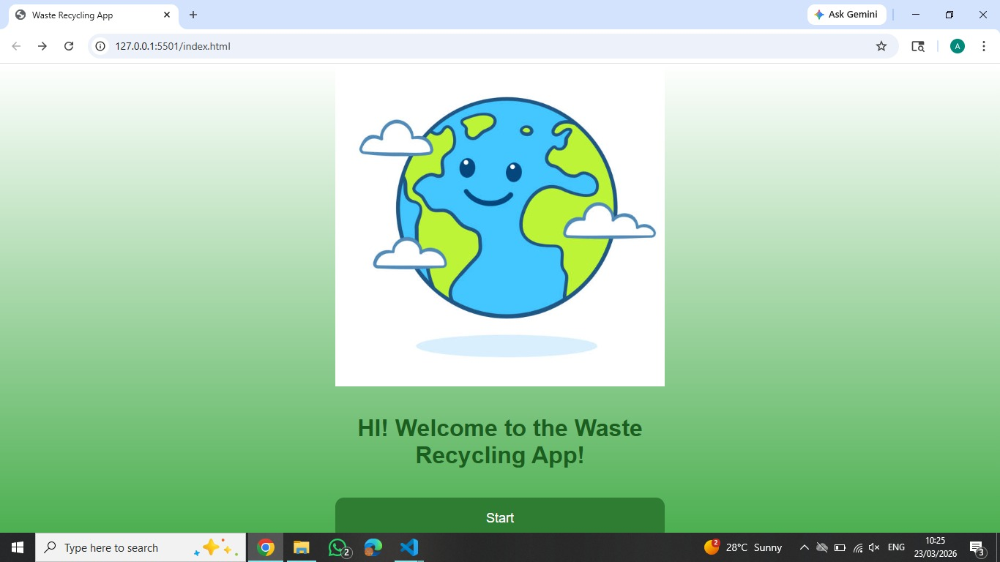
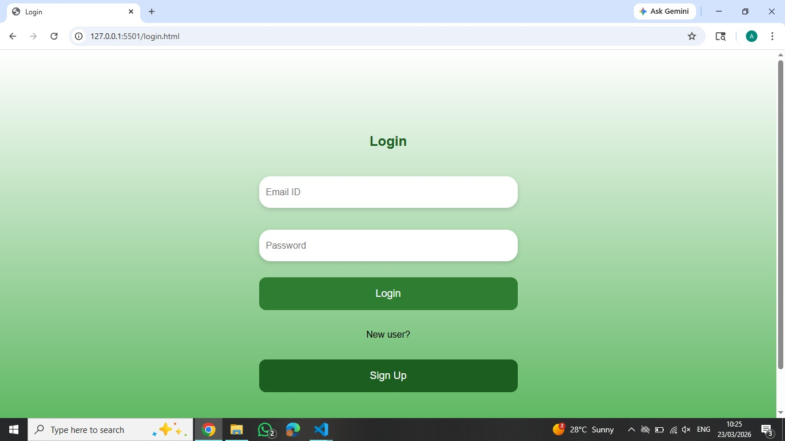
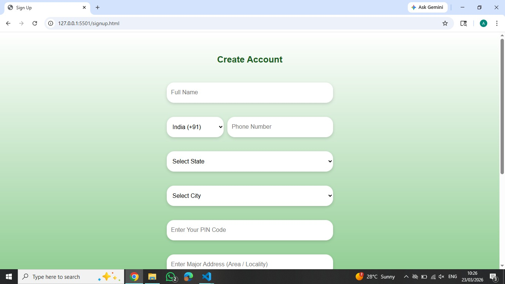
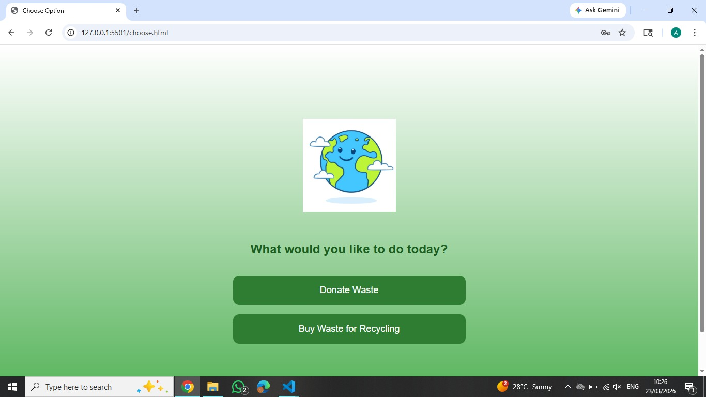
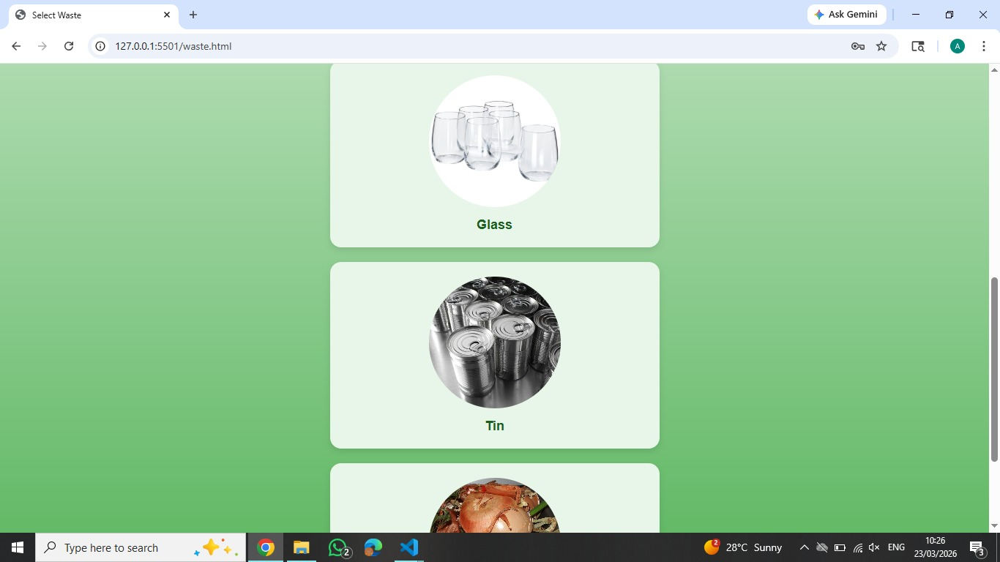
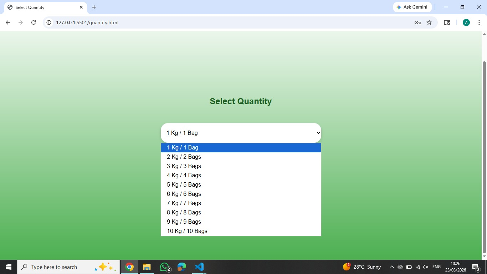
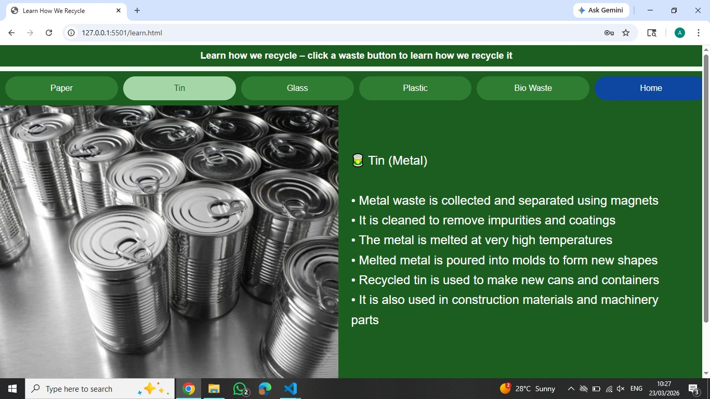

# Waste Management App

## 📌 Description
Today, many environmentally conscious people want to donate their recyclable waste instead of letting it go to landfills. However, scrap collectors do not visit regularly, making it difficult for people to dispose of waste responsibly.
At the same time, there are many small businesses that require recyclable materials to create new products.
This application also supports the collection of different types of waste such as paper, tin, glass, plastic, and biodegradable waste, which can be used for manure production.

---

## 🎯 Objective
The objective of this application is to connect customers who want to donate recyclable waste with small businesses that need these materials. This helps solve both problems efficiently by enabling direct interaction between waste providers and recyclers.

---

## 🚀 Features
- Collects recyclable waste (paper, tin, glass, plastic)
- Supports biodegradable waste for manure
- Connects users with small businesses
- Allows users from all over India to register and donate waste
- Promotes eco-friendly waste management

---

## 🛠 Tech Stack
- Frontend: HTML, CSS, JavaScript  
- Backend: (Add if any)  
- Tools: Git, GitHub  

---

## ⚙️ Installation
 Clone the repository

### 📸 Screenshots

### 🏠 Home Page (Index)

### 🔐 Login Page

### 📝 Sign Up Page

### ⚙️ Choose Page

### ♻️ Select Waste Page

### 📦 Quantity Page

### 📚 Learn Page

